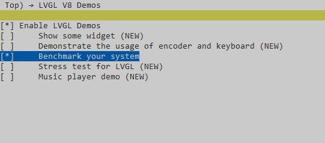

# LVGL v9 Demo
## 一、项目介绍

本示例用来演示LVGL V9的官方示例，使用官方提供的demo应用程序。
可以使用menuconfig来选择演示的demo应用程序。包含的应用程序有：
- Show some widget 演示lvgl widget的使用
- Benchmark your system 演示benchmark(依赖于“Show some widget”）
- Demonstrate the usage of encoder and keyboard 演示键盘
- Stress test for LVGL 压力测试
- Music player demo 演示音乐播放

## 工程编译及下载：
- 执行`scons --board=sf32lb52-lchspi-ulp -j8`即可生成工程
- 下载可以执行build_sf32lb52-lchspi-ulp_hcpu\uart_download.bat输入下载UART的端口号执行
                
      

使用宏定义来选择启动的demo
```c
#if  LV_USE_DEMO_WIDGETS
    #if  LV_USE_DEMO_BENCHMARK
        #define lv_demo_main lv_demo_benchmark
    #else
        #define lv_demo_main lv_demo_widgets
    #endif
#elif   LV_USE_DEMO_KEYPAD_AND_ENCODER
    #define lv_demo_main lv_demo_keypad_encoder
#elif   LV_USE_DEMO_MUSIC
    #define lv_demo_main lv_demo_music
#elif   LV_USE_DEMO_STRESS
    #define lv_demo_main  lv_demo_stress
#else
    #error "Select a demo application to start"
#endif
```
我们可以在menuconfig中选择想使用的demo




## 二、main.c 分析 —— 程序入口与主循环
1. main 函数
```c
int main(void)
{
    rt_err_t ret = RT_EOK;
    rt_uint32_t ms;

    /* init littlevGL */
    ret = littlevgl2rtt_init("lcd");//初始化lvgl的显示驱动和输入设备
    if (ret != RT_EOK)
    {
        return ret;
    }

    lv_demo_main();  // 启动指定的 demo（根据宏定义）

    while (1)
    {
        ms = lv_task_handler(); //  处理 LVGL 内部任务调度器
        rt_thread_mdelay(ms);
    }
    return RT_EOK;
}
```
## 三、lv_demo_benchmark.c 分析 —— Benchmark 核心逻辑
1. 入口函数：lv_demo_benchmark()
```c
//入口函数
void lv_demo_benchmark(void)
{
    scene_act = 0;

    lv_obj_t *scr = lv_screen_active();//获取当前屏幕
    lv_obj_remove_style_all(scr);//移除样式
    ...
    
    load_scene(scene_act);//加载场景

    lv_timer_create(next_scene_timer_cb, scenes[0].scene_time, NULL);//创建定时器，切换场景

#if LV_USE_PERF_MONITOR
    ...
#endif
}
```
2. 场景加载函数：load_scene(uint32_t scene)

```c
static void load_scene(uint32_t scene)
{
    lv_obj_t *scr = lv_screen_active();
    lv_obj_clean(scr);  // 清除当前屏幕内容
    ...
    if (scenes[scene].create_cb) scenes[scene].create_cb();//执行当前场景的创建回调函数
}
```
3. 场景自动切换next_scene_timer_cb(lv_timer_t *timer)
```c
static void next_scene_timer_cb(lv_timer_t *timer)
{
    scene_act++; //增加 scene_act 索引，加载下一个场景

    load_scene(scene_act); //如果当前场景时间设为 0，则结束测试并调用 summary_create()
    if (scenes[scene_act].scene_time == 0)//
    {
        lv_timer_delete(timer);
        summary_create();
    }
    else//否则更新定时器周期，继续循环播放场景
    {
        lv_timer_set_period(timer, scenes[scene_act].scene_time);
    }
}
```
4. 场景描述结构体：scene_dsc_t
```c
typedef struct
{
    const char *name;
    void (*create_cb)(void);
    uint32_t scene_time;
    uint32_t cpu_avg_usage;
    uint32_t fps_avg;
    uint32_t render_avg_time;
    uint32_t flush_avg_time;
    uint32_t measurement_cnt;
} scene_dsc_t;
```
示例场景定义
```c
static scene_dsc_t scenes[] =
{
    {.name = "Empty screen",               .scene_time = 3000, .create_cb = empty_screen_cb},
    {.name = "Moving wallpaper",           .scene_time = 3000, .create_cb = moving_wallpaper_cb},
    ...
    {.name = "", .create_cb = NULL}
};
```
5. 性能监控模块：
注册观察者
```c
lv_subject_add_observer_obj(&disp->perf_sysmon_backend.subject, sysmon_perf_observer_cb, title, NULL);
```
观察者回调函数
```c
static void sysmon_perf_observer_cb(lv_observer_t *observer, lv_subject_t *subject)
{
    const lv_sysmon_perf_info_t *info = lv_subject_get_pointer(subject);//获取系统监控信息(获取当前帧的 FPS、CPU 使用率、渲染/刷新耗时等信息)
    ...
    scenes[scene_act].cpu_avg_usage += info->calculated.cpu;
    scenes[scene_act].fps_avg += info->calculated.fps;//累计到当前场景的数据中供后续统计使用
    ...
}
```
6. 总结界面生成：

创建表格控件
```c
lv_obj_t *table = lv_table_create(lv_screen_active());
```
填充数据
```c
for (i = 0; scenes[i].create_cb; i++)
{
    lv_table_set_cell_value(table, i + 2, 0, scenes[i].name);
    ...
}
```
7. 输出日志
```c
LV_LOG("%s, %"LV_PRIu32"%%, %"LV_PRIu32", %"LV_PRIu32", %"LV_PRIu32", %"LV_PRIu32"\r\n",
       scenes[i].name,
       scenes[i].cpu_avg_usage / cnt,
       scenes[i].fps_avg / cnt,
       ...
);
```
8. 动画系统详解

传入动画结构体：lv_anim_t,并启动动画
static void color_anim(lv_obj_t *obj) //颜色动画 static void color_anim_cb(void *obj, int32_t v) //颜色动画回调函数

static void arc_anim(lv_obj_t *obj) //弧线动画 static void arc_anim_cb(void *obj, int32_t v) //弧线动画回调函数

static void scroll_anim(lv_obj_t *obj, int32_t y_max)//滚动动画 static void scroll_anim_y_cb(void *var, int32_t v) //滚动动画回调函数

static void shake_anim(lv_obj_t *obj, int32_t y_max) //摇晃动画 static void shake_anim_cb(void *obj, int32_t v) //摇晃动画回调函数
```c
lv_anim_t a;
lv_anim_init(&a);
lv_anim_set_exec_cb(&a, color_anim_cb);
...
lv_anim_start(&a);//启动动画
```
动画特性：

- 可以设置动画时长、方向、重复次数等
- 回调函数绑定具体对象属性变化（颜色、位置、角度等）


9. UI 组件构建示例：card_create()
```c
static lv_obj_t *card_create(void)
{
   lv_obj_t *panel = lv_obj_create(lv_screen_active());//创建容器
   ...////添加图像、标签、按钮等子组件
   lv_obj_t *child = lv_label_create(panel);
   ...//设置布局和样式
   return panel;
}
```
完整调用链路图
```c
main()
│
├── littlevgl2rtt_init()            → 初始化 LVGL 运行环境
│
├── lv_demo_benchmark()             → 启动 benchmark demo
│   │
│   ├── load_scene(0)                → 加载第一个场景
│   │   └── scenes[0].create_cb() => empty_screen_cb()
│   │
│   ├── lv_timer_create(...)         → 创建定时器，定时切换场景
│   │
│   └── sysmon_perf_observer_cb      → 性能数据采集回调
│
└── while (1)
   └── lv_task_handler()            → LVGL 主任务调度
```