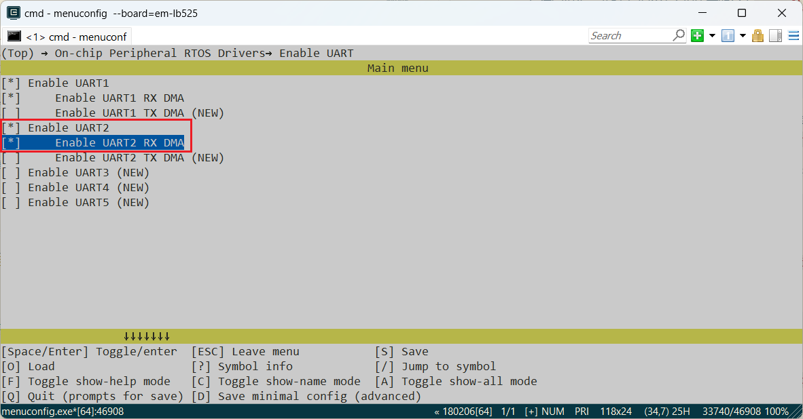
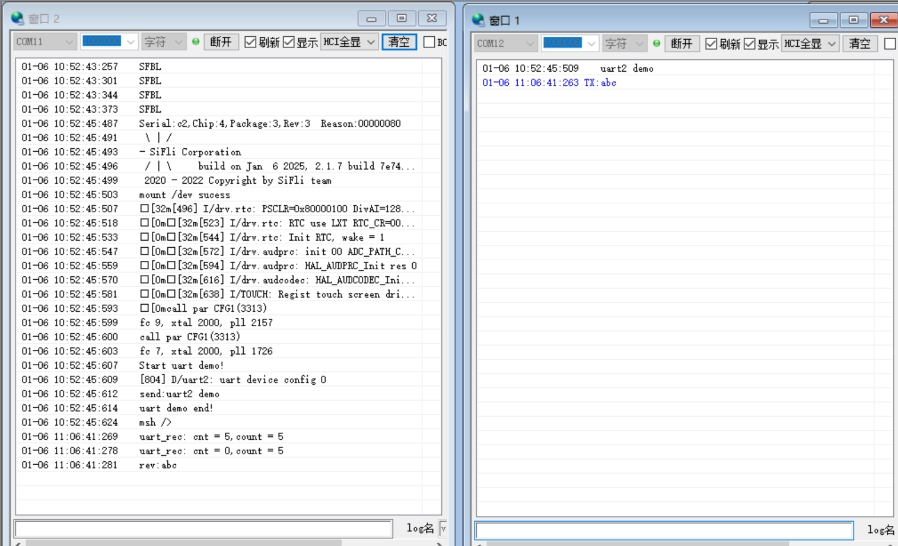
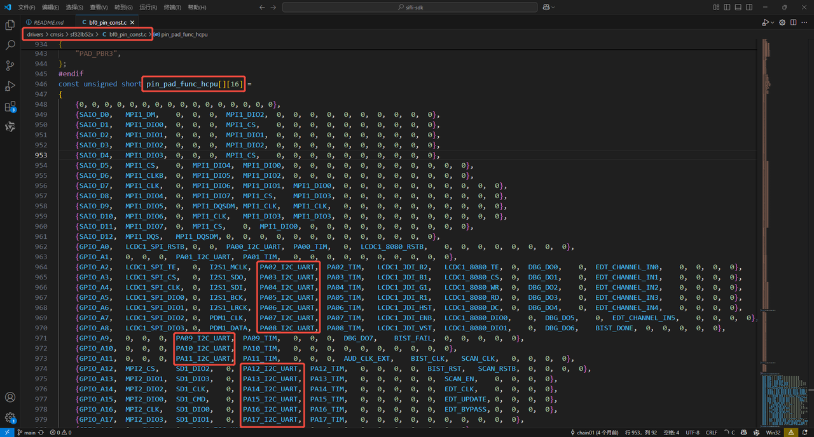

# UART示例

## 支持的平台
例程可以运行在以下开发板.
* sf32lb52-ulp

## 概述
* 在RT-Thread操作系统下采用RX DMA方式，操作UART2检验其串口的收发能力
* 注意开发板复位之后uart2打印log同下方图片内容一致即为发送成功,验证uart2的接收能力使用的是默认串口打印log来验证其接收内容的准确性

## 例程的使用
### 编译和烧录

关于编译、下载的详细步骤，请参考[](/quickstart/get-started.md)的相关介绍。
* 此例程中用到了uart2，在采用RT-Thread操作系统时，uart2外设会虚拟成了一个rt_device来进行读写操作，此时需要确认工程编译所在路径下`rtconfig.h`文件中是否包含了下面3个宏：
```c
#define BSP_USING_UART 1
#define BSP_USING_UART2 1
#define BSP_UART2_RX_USING_DMA 1
```
只有包含了上面三个宏，在`rt_hw_usart_init`函数中才会通过`rt_hw_serial_register`函数注册`"uart2`这个`rt_device`，后面该设备才能`rt_device_find`和`rt_device_open`成功。

如果缺失上面三个宏，就需要通过`menuconfig`如下命令进行打开(注意：缺失可能并不会报出错误，若配置串口没有信息打印请及时查看是否打开)
```c
menuconfig --board=sf32lb52-ulp //board=<开发板名称>
```
如下图，选择uart2和rx dma，保存并退出menuconfig，编译后查看`rtconfig.h`宏是否生成

* 切换到例程project目录，运行scons命令执行编译：
```c
scons --board=sf32lb52-ulp -j8 //board=<开发板名称>
```
* 运行`build_sf32lb52-ulp_hcpu\uart_download.bat`，按提示选择端口即可进行下载：

```c
j\uart_download.bat //执行烧录脚本

Uart Download

please input the serial port num:5 //选择对应串口号
```

### 硬件连接

|版型名称  | UART       | TX(物理位置)     | RX(物理位置)   |    
|--------|------------|---------------|-------------------|
|525    | UART2     | PAD_PA19（25）    | PAD_PA18（27）    |   


* PA19软件配置为UART2的TX，连接到电脑usb转串口的RX
* PA18软件配置为UART2的RX，连接到电脑usb转串口的TX
* GND连接到usb转串口的GND，如下图：
------


#### 例程输出结果展示:
* log输出:左边为机器log，右边为电脑usb转串口端发送数据和接收数据：


* 注意：串口开启有两个串口，一个是代码配置电脑usb转串口的uart2,一个是自带的调试口uart1（用于验证uart2的接收能力）


log结尾收到的`rev: `为接收到的电脑USB转串口TX发来的字符

* 注意：这里打印接收数据是用默认串口打印而不是uart2,因为uart2的发送数据功能也是例程中的一项
```
    SFBL
    Serial:c2,Chip:4,Package:3,Rev:3  Reason:00000080
     \ | /
    - SiFli Corporation
     / | \     build on Oct 23 2024, 2.2.0 build 00000000
     2020 - 2022 Copyright by SiFli team
    mount /dev sucess
    [32m][490] I/drv.rtc: PSCLR=0x80000100 DivAI=128 DivAF=0 B=256
    [0m][32m][517] I/drv.rtc: RTC use LXT RTC_CR=00000001
    [0m][32m][538] I/drv.rtc: Init RTC, wake = 1
    [0m][32m][565] I/drv.audprc: init 00 ADC_PATH_CFG0 0x606
    [0m][32m][587] I/drv.audprc: HAL_AUDPRC_Init res 0
    [0m][32m][609] I/drv.audcodec: HAL_AUDCODEC_Init res 0
    [0m][32m][630] I/TOUCH: Regist touch screen driver, probe=1203a299 
    [0mcall par CFG1](35bb)
    fc 9, xtal 2000, pll 2050
    call par CFG1(35bb)
    fc 9, xtal 2000, pll 2051
    Start uart demo!
    [796] D/uart2: uart device config 0
    send:uart2 demo
    uart demo end!
    msh />
    uart_rec: cnt = 5,count = 5
    uart_rec: cnt = 0,count = 5
    rev:abc
```
下面为开发板复位后电脑USB转串口发送的数据`uart2 demo`字符以及检验uart2是否能接收串口数据而人为发送的数据
```c    
    uart2 demo
    TX:abc
```
检验uart2的接收内容正确性功能:在uart2的log窗口下发送了abc,进入对应uart2的中断后会接收到`abc`字符、换行符，回车符，共5个字符ASCII码,打印以下内容
* 注意:始终多打印一次log是考虑到持续接收会导致超出可接收的最大值从而分多次接收如:接收最大为256而接收的是260则会打印\
uart_rec: cnt = 256,count = 256\
uart_rec: cnt = 4,count = 260\
uart_rec: cnt = 0,count = 260
```c    
    uart_rec: cnt = 5,count = 5
    uart_rec: cnt = 0,count = 5
    rev:abc
```

#### uart2配置流程
* 确保编译后`rtconfig.h`文件中是否包含了下面3个宏：
编译窗口输入命令查看board=（版型）
```c
#define BSP_USING_UART 1
#define BSP_USING_UART2 1
#define BSP_UART2_RX_USING_DMA 1

menuconfig --board=sf32lb52-ulp
```


* 设置对应的Uart2对应的IO口
```c
    HAL_PIN_Set(PAD_PA18, USART2_RXD, PIN_PULLUP, 1);
    HAL_PIN_Set(PAD_PA19, USART2_TXD, PIN_PULLUP, 1);

```
---
**注意**: 
1. UART引脚怎么选：可以配置到任意带有PA*_I2C_UART功能的IO输出UART2波形（想查询引脚复用表可在项目路径下文件中查找如：bf0_pin_const.c）
- 本例程演示的是外接USB转串口模块，因此引脚选择有排针引出的引脚

2.  HAL_PIN_Set 最后一个参数为hcpu/lcpu选择, 1:选择hcpu,0:选择lcpu 
3.  Hcpu的PA口不能配置为Lcpu的uart外设，比如uart5,uart6输出
---
* 串口初始化函数int uart2_init(void)部分内容讲解:\
先后`rt_device_find`,`rt_device_control`,`rt_device_open`分别查找、配置和打开`uart2`设备

```c
//前置准备
#define DBG_TAG "uart2" // 当前模块的日志标签为 "uart2"
#define DBG_LVL DBG_LOG //日志输出级别为 LOG 级别
#include <rtdbg.h> // 包含 RT-Thread 的日志系统支持

#define UART_DEMO_NAME "uart2" //uart设备名称
#define ONE_DATA_MAXLEN 256 //单次最大接收数据长度为 256 字节

static rt_device_t g_uart_device = RT_NULL;//用于存储找到的设备
static struct rt_semaphore rx_sem;//一个信号量，用于通知主线程接收到数据
static uint8_t data[ONE_DATA_MAXLEN] = { 0 };//一个静态缓冲区，用于存储从 UART 接收的数据
```

查找设备，并以一定的模式(如：以DMA模式)打开设备，先注册接收回调函数并创建接收线程，将线程打开
```c
//串口初始化函数
void uart2_init(void)
{
  g_uart_device = rt_device_find(UART_DEMO_NAME);//查找uart2设备
  if (!g_uart_device)
  {
      LOG_E("find %s failed!\n", UART_DEMO_NAME);
      return RT_ERROR;
  }
   
  { //单独括起来限制err的作用域，防止后续代码同名变量影响
      rt_err_t err;
      struct serial_configure config = RT_SERIAL_CONFIG_DEFAULT; // 使用默认uart配置
      config.baud_rate = 1000000; // 修改波特率
      err = rt_device_control(g_uart_device, RT_DEVICE_CTRL_CONFIG, &config);//应用上述的配置
      LOG_D("uart device config %d", err);
  }
  
  rt_sem_init(&rx_sem, "rx_sem", 0, RT_IPC_FLAG_FIFO);//初始化信号量为0
  // 尝试以 DMA 模式打开设备 
  rt_err_t open_result = rt_device_open(g_uart_device, RT_DEVICE_OFLAG_RDWR | RT_DEVICE_FLAG_DMA_RX);
   if (open_result == -RT_EIO)// 如果不支持 DMA，则使用中断模式
   {
       rt_device_open(g_uart_device, RT_DEVICE_OFLAG_RDWR | RT_DEVICE_FLAG_INT_RX);
   }
   /* 设置接收回调函数 */
   rt_device_set_rx_indicate(g_uart_device, uart_rx_ind);
   /* 创建接收线程 */
   rt_thread_t thread = rt_thread_create("g_uart_device",
                                         serial_rx_thread_entry,
                                         RT_NULL,
                                         3 * 1024,   // 线程栈大小
                                         12,         // 优先级
                                         10);        // 时间片
   if (thread != RT_NULL)
   {
       rt_thread_startup(thread);   // 启动线程
   }
   else
   {
       ret = RT_ERROR;              // 线程创建失败
   }
   return ret;
}
```
现在我们增加接收回调函数，回调函数我们做释放信号量的处理，具体处理接收的数据我们用线程去处理

```c
static rt_err_t uart_rx_ind(rt_device_t dev, rt_size_t size)//接收回调函数，当接收到数据时被调用
{
    if (size > 0)
    {
        rt_sem_release(&rx_sem);   // 释放信号量，唤醒接收线程
    }
    return RT_EOK;
}
```
现在我们增加线程入口函数，线程内等待接收回调函数释放的信号量

```c
static void serial_rx_thread_entry(void *parameter)//UART 接收线程入口函数
{
    uint16_t count = 0;      // 已接收字节数
    uint8_t cnt = 0;         // 每次读取的字节数

    while (1)
    {
        // 等待接收信号量（阻塞直到有数据）
        rt_sem_take(&rx_sem, RT_WAITING_FOREVER);

        while (1)
        {
            // 从 UART 设备读取数据
            cnt = rt_device_read(g_uart_device, -1, &data[count], ONE_DATA_MAXLEN);
            count += cnt;

            // 打印调试信息
            rt_kprintf("uart_rec: cnt = %d,count = %d\n", cnt, count);

            if (0 == cnt) break;   // 如果没有更多数据可读，退出循环
        }

        rt_kprintf("rev:");       // 打印接收提示
        for (uint16_t i = 0; i < count; i++)
        {
            rt_kprintf("%c", data[i]);  // 打印接收到的字符
        }
        count = 0;               // 清空计数器
        rt_kprintf("\n");        // 换行
    }
}
```
* 打开`finsh`功能后，可以log串口终端输入`list_device`可以查看`uart2`是否open状态，0表示设备已经注册，1，2表示设备open的次数

```c
 TX:list_device
   list_device
   device           type         ref count
   -------- -------------------- ----------
   audcodec Sound Device         0       
   audprc   Sound Device         0       
   rtc      RTC                  0       
   pwm3     Miscellaneous Device 0       
   touch    Graphic Device       0       
   lcdlight Character Device     0       
   lcd      Graphic Device       0       
   i2c4     I2C Bus              0       
   i2c1     I2C Bus              0       
   lptim1   Timer Device         0       
   btim1    Timer Device         0       
   uart2    Character Device     1       
   uart1    Character Device     2       
   pin      Miscellaneous Device 0       
   msh />
```
* 这里只是演示了uart的一种推荐用法，其他操作，在rt-thread操作系统下，可以参考[RT-Thread UART API](https://www.rt-thread.org/document/site/#/rt-thread-version/rt-thread-standard/programming-manual/device/uart/uart_v1/uart) 


## 异常诊断
* uart2无波形输出
1. `pin status 18/19`命令查看对应PA18，PA19的IO状态FUNC对不对，VAL电平应该是1
```c
    msh />
 TX:pin status 18
    pin status 18
    [I/TEST.GPIO] PIN 18, FUNC=4, VAL=1, DIG_IO_PU, GPIO_MODE_INPUT, irqhdr=/, arg=/
    msh />
    msh />
 TX:pin status 19
    pin status 19
    [I/TEST.GPIO] PIN 19, FUNC=4, VAL=1, DIG_IO_PU, GPIO_MODE_INPUT, irqhdr=/, arg=/
    msh />
    msh />
```
2. `list_device`命令查看`uart2`设备是不是存在并且打开了
3. 检查uart2配置流程是否都已生效
* uart2波形正常，电脑串口接收不到数据
1. 检测uart2输出和电脑串口连接是否正常，需要TX接RX,RX连接TX，波特率是否一致,以及引脚对应的TX,RX是否正确
2. 检测硬件连接，包括uart2输出电平跟电脑uart电平是否一致
* 电脑串口发出数据，uart2出现数据接收丢失现象
1. 确认串口DMA的buffer长度是否足够 `#define RT_SERIAL_RB_BUFSZ 256`

## 参考文档
* RT-Thread官网 https://www.rt-thread.org/document/site/#/rt-thread-version/rt-thread-standard/programming-manual/device/uart/uart_v1/uart
