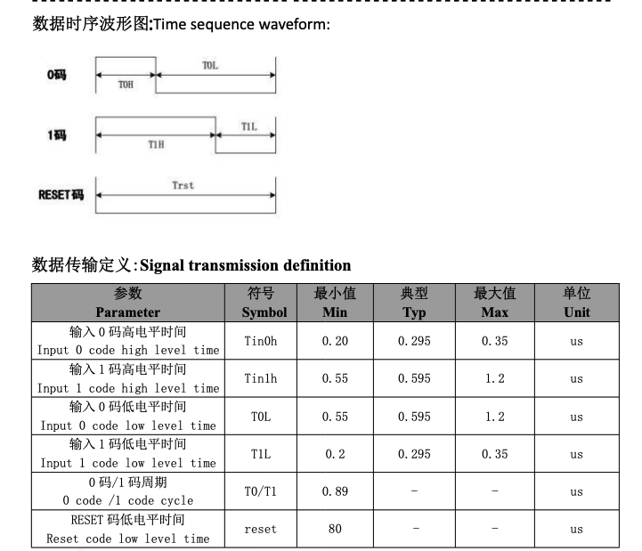
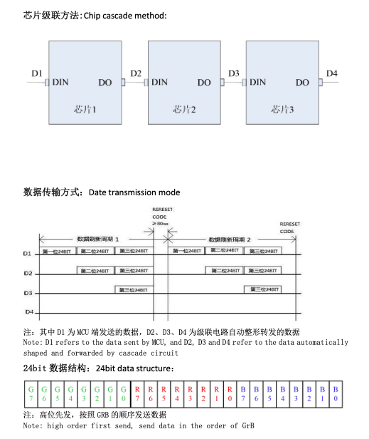
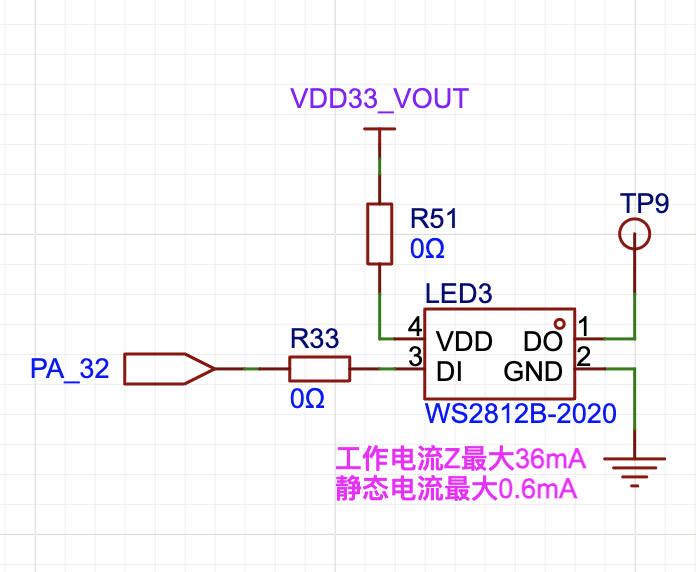
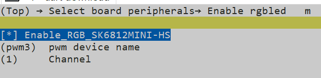

# WS2812 示例

在日常生活中，我们不免会接触到各种各样的光源。众所周知，任何颜色的光源都可以通过红、绿、蓝三种颜色的光源混合而成，这样我们最多只需要三颗灯珠就可以合成任意颜色的光源了。但是如果要单独控制每一颗灯珠的颜色的话需要很多的 IO，这时候 WS2812 之类的灯珠就派上用场了。WS2812 是一种智能控制的 LED 灯珠，它可以通过单线串行通信来控制每颗灯珠的颜色和亮度，并且可以级联多个灯珠。

## WS2812 通信协议

WS2812 使用一种叫做单极归零码的协议。查询手册我们可以看到它的时序定义：



可以看出来，和常用的 UART 等协议不同，它的每一个 bit 总是从高电平开始，到低电平结束，每一个 bit 周期内都会有一次下降沿发生，因此称之为单极归零码。其中的高低电平的不同持续时间也就决定了是逻辑 1 还是逻辑 0。并且每个 bit 的持续时间总是差不多的，整体来说通信的速率差不多是 800Kbps。

另外需要注意的就是 RESET 信号，它是一个低电平信号，持续时间大于 80us 时会重置通信。这个信号在实际应用中通常是由主控芯片在发送完数据后主动拉低的。

## WS2812 显示格式

我们知道，任何颜色的光都可以通过 RGB 三种颜色混合而成。幸运的是 WS2812 给我们提供了一个方便的接口，可以直接设置每颗灯珠的 RGB 值。每颗灯珠的 RGB 值由 3 个字节共 24 个 bit 组成，分别表示红色、绿色和蓝色的亮度值。每个字节的取值范围是 0-255。



另外在图中也可以看出，如果发完一个灯珠的数据后继续发送下一个灯珠的数据，那么第一颗灯珠将会自动转发数据给第二颗灯珠。因此我们可以通过级联多个 WS2812 灯珠来实现更复杂的显示效果。

## 代码详解



从硬件连接中可以看出，WS2812 连接到了`PA32`上，并且电源使用的是芯片片上 LDO 输出。因此在使用之前需要先打开芯片的 LDO 电源输出。

在 SiFli-SDK 中，对 WS2812 之类的灯珠进行了封装，可以直接使用`rgbled`设备进行操作。需要注意的是，WS2812 的通信模拟我们使用定时器+DMA 的形式进行模拟。因此在使用之前我们需要初始化定时器的 IO，以及打开灯珠供电的电源。

```c
static void rgb_led_init()
{
    HAL_PMU_ConfigPeriLdo(PMU_PERI_LDO3_3V3, true, true);
    HAL_PIN_Set(PAD_PA32, GPTIM2_CH1, PIN_NOPULL, 1);
    rgbled_device = rt_device_find(RGBLED_NAME); // find rgb
    if (!rgbled_device)
    {
        RT_ASSERT(0);
    }
}
```

接下来我们就可以控制灯珠颜色了，我们使用以下函数来进行：

```c
static void rgb_led_set_color(uint32_t color)
{
    struct rt_rgbled_configuration configuration;
    configuration.color_rgb = color;
    rt_device_control(rgbled_device, PWM_CMD_SET_COLOR, &configuration);
}
```

## 易错点

1. rgbled 依赖 pwm 设备，因此需要在 menuconfig 中配置 RGBLED 的使能以及 pwm 设备名称和通道。需要注意的是修改了 pwm 设备名称和通道之后，初始化的 PINMUX 同样需要修改。


